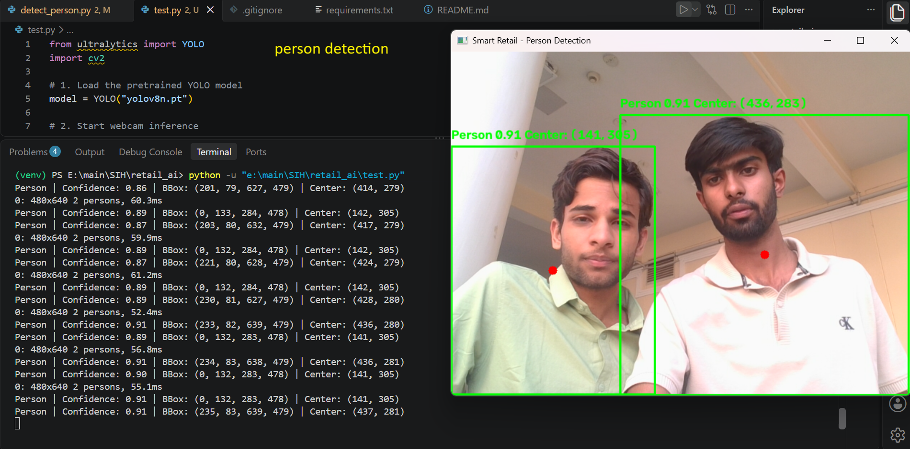
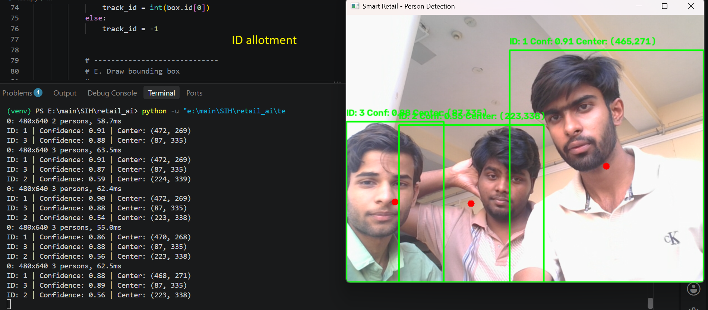
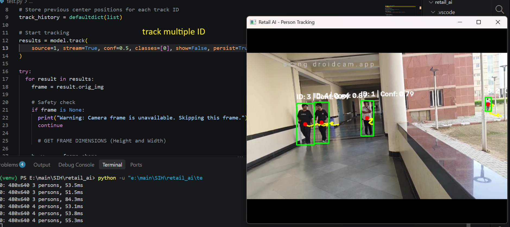
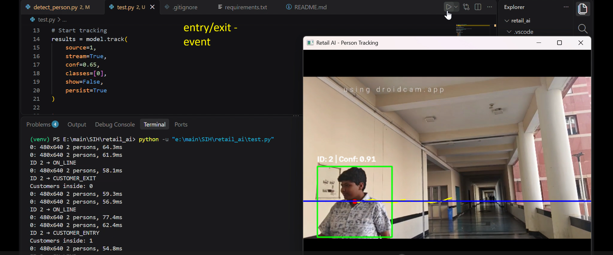
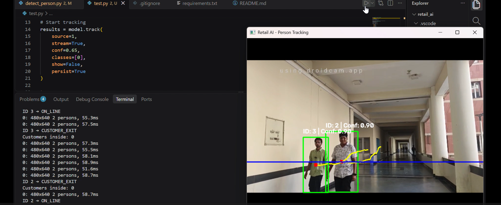

# Smart Retail AI

AI-powered computer vision system for understanding customer movement and occupancy inside a retail environment.

The project currently focuses on the **people-intelligence layer** of a smart retail system: detecting people, tracking their movement, identifying entry and exit events, and maintaining the number of customers currently inside the monitored area.

> **Current status:** Person detection, tracking, trajectory visualization, entrance-line state detection, entry/exit detection, customer counting, and multi-person testing are implemented.

---

## Project Vision

Traditional CCTV systems primarily record what happens inside a store.

This project aims to move from **recording** to **understanding**.

The long-term system is designed around the following pipeline:

```text
Camera / Sensors
       ↓
Computer Vision
       ↓
People + Products + Observations
       ↓
Tracking & State Management
       ↓
Events
       ↓
Retail Analytics
       ↓
Alerts / Predictions / Decisions
```

The current implementation builds the foundation of this pipeline using a camera and computer vision.

---

## Current Problem

A retail camera can capture video continuously, but raw video alone does not directly provide structured information such as:

* How many customers entered?
* How many customers are currently inside?
* When did a customer enter?
* When did a customer leave?
* How is a person moving through the monitored area?

The current project converts visual observations into structured customer movement events.

---

## Current Solution

The system uses YOLO-based computer vision and object tracking to:

1. Detect people in the camera feed.
2. Assign tracking IDs to detected people.
3. Calculate the center point of each person's bounding box.
4. Store recent center points to create a movement trajectory.
5. Define an entrance boundary.
6. Classify a person's position relative to that boundary.
7. Detect entry and exit state transitions.
8. Maintain a live customer occupancy count.
9. Handle multiple tracked people simultaneously.

---

## System Architecture

```text
                    CAMERA
                       │
                       ▼
              ┌─────────────────┐
              │ YOLO Detection  │
              │   Person Class  │
              └────────┬────────┘
                       │
                       ▼
              ┌─────────────────┐
              │ Object Tracking │
              │    Track IDs    │
              └────────┬────────┘
                       │
             ┌─────────┴─────────┐
             ▼                   ▼
       Bounding Box         Track History
             │                   │
             ▼                   ▼
       Center Point           Trajectory
             │
             ▼
      Entrance Line / Zone
             │
             ▼
      Position Classification
             │
             ▼
       State Transition
             │
       ┌─────┴─────┐
       ▼           ▼
     ENTRY        EXIT
       │           │
       └─────┬─────┘
             ▼
     Customer Occupancy
```

---

## Implemented Features

### 1. Person Detection

The system uses the YOLO model to detect people from the camera feed.

Only the COCO `person` class is processed.

```text
classes = [0]
```

A confidence threshold is also used to reduce unwanted detections.

Current configuration:

```text
Confidence threshold: 0.65
```

---

### 2. Person Tracking

The project uses Ultralytics tracking through:

```python
model.track(...)
```

Each tracked person receives a temporary tracking ID.

Example:

```text
ID 1
ID 3
ID 5
```

The ID allows the system to associate detections across consecutive frames.

> **Important limitation:** These are tracker IDs, not permanent identities. If a person leaves the camera's tracking range and later returns, the tracker may assign a new ID.

Long-term customer re-identification is planned for a later stage.

---

### 3. Center Point Calculation

For every detected person, the system calculates the center of the bounding box:

```text
center_x = (x1 + x2) / 2
center_y = (y1 + y2) / 2
```

This center point becomes the basic spatial representation used for movement analysis.

---

### 4. Trajectory Tracking

The system stores recent center points for each tracked person.

The current implementation keeps up to:

```text
30 recent positions
```

These points are connected to visualize the person's movement trajectory.

Conceptually:

```text
●
  ●
    ●
      ●
        ●
          ●
```

This creates the foundation for future movement and dwell-time analysis.

---

### 5. Entrance Line Detection

A horizontal entrance boundary is currently defined at:

```text
ENTRANCE_Y = 300
```

A tolerance zone is used around the boundary:

```text
LINE_TOLERANCE = 5
```

The person's center point is classified as:

```text
center_y < 295
        ↓
     INSIDE

295 ≤ center_y ≤ 305
        ↓
     ON_LINE

center_y > 305
        ↓
     OUTSIDE
```

This prevents small frame-to-frame fluctuations around the boundary from immediately being interpreted as an entry or exit.

---

### 6. Entry / Exit State Machine

Customer movement is interpreted as a sequence of states.

#### Entry

```text
OUTSIDE
   ↓
ON_LINE
   ↓
INSIDE
   ↓
CUSTOMER_ENTRY
```

When this transition occurs:

```text
customers_inside += 1
```

#### Exit

```text
INSIDE
   ↓
ON_LINE
   ↓
OUTSIDE
   ↓
CUSTOMER_EXIT
```

When this transition occurs:

```text
customers_inside -= 1
```

The occupancy value is prevented from becoming negative.

---

## Example Output

A successful entry can produce:

```text
ID 1 → ON_LINE
Customers inside: 0

ID 1 → CUSTOMER_ENTRY
Customers inside: 1
```

A complete entry and exit sequence:

```text
ID 3 → ON_LINE
Customers inside: 0

ID 3 → CUSTOMER_ENTRY
Customers inside: 1

ID 3 → ON_LINE
Customers inside: 1

ID 3 → CUSTOMER_EXIT
Customers inside: 0
```

---

## Multi-Person Testing

The system has also been tested with multiple people being tracked simultaneously.

Example:

```text
ID 1 → CUSTOMER_ENTRY
Customers inside: 1

ID 3 → CUSTOMER_ENTRY
Customers inside: 2

ID 1 → CUSTOMER_EXIT
Customers inside: 1

ID 3 → CUSTOMER_EXIT
Customers inside: 0
```

This demonstrates that occupancy is maintained across multiple tracked individuals rather than being limited to a single person.

---

## Technology Stack

| Component            | Technology                 |
| -------------------- | -------------------------- |
| Programming Language | Python                     |
| Computer Vision      | OpenCV                     |
| Object Detection     | YOLO                       |
| Object Tracking      | Ultralytics YOLO Tracking  |
| Input                | Webcam / Camera            |
| Current Model        | YOLOv8n                    |
| Environment          | Python virtual environment |
| Development          | VS Code                    |
| Version Control      | Git + GitHub               |

### Current Python Dependencies

```text
opencv-python==5.0.0.93
ultralytics==8.4.171
```

Install them with:

```bash
pip install -r requirements.txt
```

---

## Running the Project

### 1. Clone the repository

```bash
git clone https://github.com/akulsaini/smart-retail-ai-sih.git
```

### 2. Enter the project directory

```bash
cd smart-retail-ai-sih
```

### 3. Create a virtual environment

```bash
python -m venv venv
```

### 4. Activate the environment

Windows PowerShell:

```powershell
.\venv\Scripts\activate
```

### 5. Install dependencies

```bash
pip install -r requirements.txt
```

### 6. Run the system

```bash
python detect_person.py
```

The system will open the camera feed and display:

* Person bounding boxes
* Tracking IDs
* Confidence scores
* Center points
* Movement trajectories
* Entrance boundary
* Entry/exit events
* Current customer occupancy

Press:

```text
q
```

to stop the program.

---

## Development Progress

The project has been developed incrementally rather than as a single implementation.

```text
Person Detection
      ↓
Object Tracking
      ↓
Track ID Handling
      ↓
Trajectory Tracking
      ↓
Entrance Boundary
      ↓
Position State Classification
      ↓
Entry / Exit Detection
      ↓
Customer Occupancy Counting
      ↓
Multi-Person Testing
```

The Git history records these development stages and debugging iterations.

---

## Current Limitations

The current implementation is intentionally focused on the people-intelligence foundation.

### Short-term tracking IDs

Tracker IDs represent tracked objects during the camera session. They are not permanent customer identities.

A customer leaving the camera view and returning may receive a different ID.

### Single entrance boundary

The current entry/exit mechanism uses one manually defined horizontal boundary.

Different store layouts would require configurable entrance zones.

### Camera perspective

The accuracy of entry/exit detection depends on camera placement, viewing angle, lighting, and how people cross the defined boundary.

### No product intelligence yet

The current system does not yet identify individual products or determine shelf inventory.

### No long-term analytics yet

The current system generates real-time movement events and occupancy information. Historical analytics and predictive intelligence are future development stages.

---

## Roadmap

### People Intelligence

* [x] Person detection
* [x] Person tracking
* [x] Center-point extraction
* [x] Trajectory visualization
* [x] Entrance-line detection
* [x] Entry/exit detection
* [x] Customer occupancy counting
* [x] Multi-person testing
* [ ] Queue detection
* [ ] Customer dwell-time analysis
* [ ] Movement pattern analysis
* [ ] Long-term customer re-identification

### Product & Inventory Intelligence

* [ ] Product detection
* [ ] Shelf detection
* [ ] Product movement observation
* [ ] Inventory state estimation
* [ ] Stock-level monitoring

### Store Intelligence

* [ ] Store state management
* [ ] Historical analytics
* [ ] Queue alerts
* [ ] Inventory alerts
* [ ] Customer behavior analytics
* [ ] Predictive intelligence
* [ ] Sensor fusion

---

## Project Direction

The ultimate goal is to transform raw store observations into structured retail intelligence.

```text
WHAT THE CAMERA SEES
        ↓
WHAT THE AI DETECTS
        ↓
WHAT THE SYSTEM UNDERSTANDS
        ↓
WHAT THE STORE CAN ACT UPON
```

The current project represents the first major layer of that system: **understanding people movement and store occupancy from visual data.**

---

## Project Status

**Current stage:** Active development

**Implemented:** People detection, tracking, trajectory, entry/exit state detection, occupancy counting, and multi-person testing.

**Next development focus:** Queue detection, customer movement analysis, and progressively expanding from people intelligence toward product and store intelligence.

## Implementation Evidence

The following screenshots document the current working implementation of the computer-vision pipeline.

### 1. Person Detection

YOLO detects people from the camera feed and identifies them as the target class.



### 2. Unique Tracking ID

The tracking system assigns a temporary unique ID to each detected person, allowing the system to follow individual detections across consecutive frames.



### 3. Person Tracking and Trajectory

The system tracks multiple detected people simultaneously, assigns tracking IDs, and maintains their recent movement history using center-point coordinates.



### 4. Customer Entry Event

The entrance state machine detects an OUTSIDE -> ON_LINE -> INSIDE transition and registers a customer entry event.



### 5. Customer Exit Event

The state machine detects an INSIDE -> ON_LINE -> OUTSIDE transition and registers a customer exit event.



### 6. No-Person Frame Handling

When a camera frame contains no detected people, the system safely continues processing instead of attempting to access missing detection data.